# LoadCalc — Visual Reference

Four diagrams for navigating the codebase efficiently.

---

## 1. UI Wireframe — Page Layout

```mermaid
block-beta
  columns 1

  block:header["HEADER"]:1
    columns 2
    title["LoadCalc\nFast, on-site safety checks"]
    badge["● Offline (badge)"]
  end

  space

  block:card["STEP CARD (.card)"]:1
    columns 1

    block:s1["STEP 1 — Select Materials"]:1
      columns 1
      search["Search input"]
      filters["Filters: Rigid | Loose | Stackable | ★ Favorites"]
      mat["Material dropdown"]
      block:addrow["Add row"]:1
        columns 3
        qty["Quantity / Volume"]
        toggle["lbs | kg"]
        addbtn["+ Add to Load"]
      end
      block:items["Load Items (shown when items exist)"]:1
        columns 1
        header_row["Load Items ———————— Clear all"]
        list["• Item A  ×2  120 lbs  [edit] [✕]\n• Item B  ×1   45 lbs  [edit] [✕]"]
      end
      block:summary["Load Summary card"]:1
        columns 2
        total["Running total: 165 lbs"]
        gauge_label["Load vs. Limit: — "]
        gauge_bar["━━━━━━━━━━━░░░░░░░"]
        space
      end
    end

    block:s2["STEP 2 — Set Load Conditions (locked until Step 1 complete)"]:1
      columns 2
      dist["Distribution\n[Even ▾]"]
      sup["Support\n[Scaffold ▾]"]
      sf["Safety Factor [1.0]"]
      space
    end

    block:s3["STEP 3 — Review & Calculate (locked until Step 2 complete)"]:1
      columns 2
      calcbtn["Calculate"]
      sharebtn["Share"]
    end

    block:extras["Collapsible sections"]:1
      columns 2
      presets["◈ Presets"]
      custmat["+ Custom Materials"]
    end
  end

  space

  block:results["RESULTS PANEL (hidden until Calculate is clicked)"]:1
    columns 1
    breakdown["Per-item weight breakdown\nTotal Weight | Distribution | Support\nSafety Factor: 1.5× (50% safety buffer applied)\nAdjusted Limit | Status"]
    block:compare["Support Comparison table"]:1
      columns 4
      c1["Support"] c2["Adj. Limit"] c3["Load %"] c4["Status"]
      r1["Scaffold"] r2["500 lbs"] r3["87%"] r4["⚠ FAIL"]
      r5["Hoist"] r6["1,000 lbs"] r7["43%"] r8["✓ PASS"]
    end
    actions["[Copy Result]  [Save as Image]  [Export CSV]"]
    history["Recent\n━━━━━\n✓ PASS  165 lbs / 1,000 lbs — hoist  just now"]
  end

  space

  block:footer["FOOTER"]:1
    columns 1
    disclaimer["This tool provides general guidance only…"]
    version["LoadCalc v1.0.0"]
  end
```

---

## 2. HTML Component Structure

```mermaid
graph TD
    Page["index.html"]

    Page --> Header["&lt;header&gt; .site-header"]
    Page --> Main["&lt;main&gt;"]
    Page --> ResultsPanel["#resultsPanel .card"]
    Page --> Footer["&lt;footer&gt; .site-footer"]
    Page --> Modal["#materialModal"]

    Header --> Title[".title — LoadCalc"]
    Header --> Sub[".sub — tagline"]
    Header --> OfflineBadge["#offlineBadge"]

    Main --> Card[".card"]
    Card --> Form["#loadForm"]
    Card --> HR1["&lt;hr&gt;"]
    Card --> Presets["&lt;details&gt; .presets"]
    Card --> HR2["&lt;hr&gt;"]
    Card --> CustomMats["&lt;details&gt; .custom-materials"]

    Form --> StepHeader1[".step-header — Step 1"]
    Form --> Search["#materialSearch"]
    Form --> Filters[".filters fieldset"]
    Form --> MaterialSelect["#material"]
    Form --> MaterialNotes["#materialNotes"]
    Form --> MaterialActions[".material-actions"]
    Form --> RowAdd[".row.row-add"]
    Form --> AddError["#addError"]
    Form --> LoadItems["#loadItems"]
    Form --> LoadSummary["#loadSummary"]
    Form --> Step2Section["#step2Section"]
    Form --> Step3Section["#step3Section"]

    RowAdd --> QtyInput["#quantity"]
    RowAdd --> UnitToggle[".unit-toggle  lbs|kg"]
    RowAdd --> AddBtn["#addToLoadBtn"]

    LoadItems --> LoadHeader[".load-items-header"]
    LoadItems --> EmptyState["#loadEmptyState"]
    LoadItems --> LoadList["#loadItemsList"]
    LoadHeader --> ClearBtn["#clearLoadBtn"]

    LoadSummary --> TotalWeight["#loadTotalWeight"]
    LoadSummary --> GaugeLabel["#gaugeLabel"]
    LoadSummary --> GaugeBar["#gaugeBar"]

    Step2Section --> StepHeader2[".step-header — Step 2"]
    Step2Section --> ConditionsGrid[".conditions-grid"]
    Step2Section --> CustomLimitRow["#customLimitRow"]
    Step2Section --> SafetyFactor["#safetyFactor"]
    ConditionsGrid --> Distribution["#distribution + tooltip"]
    ConditionsGrid --> Support["#support + tooltip"]

    Step3Section --> StepHeader3[".step-header — Step 3"]
    Step3Section --> ActionRow[".action-row"]
    Step3Section --> QRSection["#qrSection"]
    ActionRow --> CalcBtn["#calculateBtn"]
    ActionRow --> ShareBtn["#shareLoadBtn"]

    ResultsPanel --> Results["#results"]
    ResultsPanel --> SupportComparison["#supportComparison"]
    ResultsPanel --> LoadFingerprint["#loadFingerprint"]
    ResultsPanel --> CopyBtn["#copyResultBtn"]
    ResultsPanel --> SaveImageBtn["#saveImageBtn"]
    ResultsPanel --> ExportBtn["#exportCsvBtn"]
    ResultsPanel --> HistorySection["#historySection"]
    HistorySection --> HistoryList["#historyList"]

    Modal --> ModalTitle["#modalTitle"]
    Modal --> ModalBody["#modalBody"]
    Modal --> ModalClose["#modalClose"]
```

---

## 3. CSS Architecture

```mermaid
graph LR
    subgraph Tokens["Design Tokens (:root)"]
        T1["--bg  --panel  --panel-2"]
        T2["--text  --muted"]
        T3["--accent (orange)  --accent-2 (blue)"]
        T4["--ok  --warn  shadow  ring"]
    end

    subgraph Layout["Layout & Shell"]
        L1[".wrapper — max-width 960px"]
        L2[".site-header — caution tape ::after"]
        L3[".header-row — flex space-between"]
        L4[".card — panel-2 bg, shadow, radius"]
        L5[".site-footer"]
    end

    subgraph Forms["Form Controls"]
        F1["input / select / textarea — dark bg, border, focus ring"]
        F2[".filters fieldset"]
        F3[".row — flex gap-12"]
        F4[".row-add — align flex-end"]
        F5[".unit-toggle-col — flex none"]
        F6[".conditions-grid — 2-col grid"]
    end

    subgraph Buttons["Buttons"]
        B1[".btn — orange gradient, font-weight 700"]
        B2[".btn-secondary — blue gradient"]
        B3[".btn-outline — transparent, muted border"]
        B4[".btn-ghost — no bg, muted text"]
        B5[".btn-star — no bg"]
        B6[".btn-remove — no bg, red on hover"]
        B7[".btn-edit / .btn-confirm"]
        B8[".unit-btn — in toggle group"]
    end

    subgraph StepSystem["Step System"]
        S1[".step-header — flex, border-bottom, uppercase"]
        S2[".step-num — 24px circle, orange bg"]
        S3[".step-num.inactive — muted bg"]
        S4[".step-section — opacity transition 0.3s"]
        S5[".step-section.locked — opacity 0.4, pointer-events none"]
    end

    subgraph LoadArea["Load Items Area"]
        LA1["#loadItems — border-top divider"]
        LA2[".load-items-header — flex space-between center"]
        LA3[".load-empty — muted centered placeholder"]
        LA4[".load-list — flex column gap-6"]
        LA5[".load-item — flex, dark bg, radius"]
    end

    subgraph Summary["Load Summary"]
        SU1[".load-summary — dark bg, border, radius"]
        SU2[".load-summary-title — accent color, uppercase"]
        SU3[".load-summary-row — flex space-between"]
        SU4[".gauge-track — dark bg, overflow hidden"]
        SU5[".gauge-bar — width transition, color by state"]
        SU6[".gauge-ok / .gauge-warn / .gauge-fail / .gauge-idle"]
    end

    subgraph Results["Results Panel"]
        R1[".results — border, radius"]
        R2[".results-pass / .results-warn / .results-fail"]
        R3[".sc-table — border-collapse"]
        R4[".sc-badge — inline-flex, radius 99px"]
        R5[".sc-pass / .sc-warn / .sc-fail"]
        R6[".sc-current — orange row highlight"]
        R7[".sf-hint — 11px muted"]
        R8[".btn-copy — margin-top, smaller padding"]
        R9[".btn-outline — transparent, muted"]
        R10[".result-explanation"]
        R11[".overload-advisor — orange left border"]
    end

    subgraph Collapsibles["Collapsible Sections"]
        C1[".presets — orange left border, tinted bg"]
        C2[".custom-materials — same treatment"]
        C3[".details-body — grid 0fr → 1fr transition"]
        C4[".details-inner — overflow hidden"]
        C5["summary::before — icon (◈ / +)"]
    end

    subgraph History["Recent History"]
        H1[".history-heading — 14px, border-top divider"]
        H2[".history-item — flex, dark bg, min-h 44px, hover tint"]
        H3[".history-status — bold, colored by result"]
        H4[".history-detail — flex 1, word-break"]
        H5[".history-time — muted, flex-shrink 0"]
    end

    subgraph Responsive["Responsive / Print"]
        RE1["@media max-width 480px — stack rows, full-width btns"]
        RE2["@media max-width 400px — tagline 0.75em"]
        RE3["@media print — hide toggles, buttons; force white bg"]
    end

    Tokens --> Layout
    Tokens --> Forms
    Tokens --> Buttons
    Layout --> Forms
    Forms --> StepSystem
    StepSystem --> LoadArea
    LoadArea --> Summary
    Summary --> Results
    Results --> Collapsibles
    Collapsibles --> History
    Layout --> Responsive
```

---

## 4. JavaScript Function Dependency Graph

```mermaid
graph TD
    subgraph Init["Initialisation (runs on load)"]
        INIT["page load"]
        INIT --> updateMaterialOptions
        INIT --> updateSupportLabels
        INIT --> renderCustomMaterials
        INIT --> renderPresets
        INIT --> loadFromUrl
        INIT --> updateStepLocks
    end

    subgraph Core["Core render cycle"]
        renderLoadItems --> updateCalculateBtn
        renderLoadItems --> updateGauge
        renderLoadItems --> updateStepLocks
        updateGauge --> resetGauge
        updateGauge --> getEffectiveLimit
    end

    subgraph LoadManagement["Load management"]
        addToLoad --> renderLoadItems
        removeFromLoad --> renderLoadItems
        confirmEdit --> renderLoadItems
        confirmEdit --> showInlineError
        confirmEdit --> clearInlineError
        addToLoad --> showInlineError
        addToLoad --> clearInlineError
    end

    subgraph PresetFlow["Preset flow"]
        savePreset --> getPresets
        savePreset --> renderPresets
        savePreset --> showInlineError
        savePreset --> clearInlineError
        renderPresets --> getPresets
        renderPresets --> loadPreset
        renderPresets --> deletePreset
        loadPreset --> renderLoadItems
        loadPreset --> updateGauge
        loadPreset --> updateDistributionHint
        loadPreset --> showInlineError
        loadPreset --> clearInlineError
        deletePreset --> getPresets
        deletePreset --> renderPresets
    end

    subgraph MaterialFlow["Material / favorites flow"]
        updateMaterialOptions --> getSelectedTypes
        updateMaterialOptions --> getFavorites
        updateMaterialOptions --> renderSelectedMaterialNotes
        renderSelectedMaterialNotes --> renderFavoriteBtn
        renderFavoriteBtn --> isFavorite
        isFavorite --> getFavorites
        toggleFavorite --> getFavorites
        toggleFavorite --> saveFavorites
        toggleFavorite --> renderFavoriteBtn
        toggleFavorite --> updateMaterialOptions
        refreshMaterials --> getCustomMaterials
        refreshMaterials --> updateMaterialOptions
    end

    subgraph CustomMatsFlow["Custom materials flow"]
        renderCustomMaterials --> getCustomMaterials
        renderCustomMaterials --> deleteCustomMaterial
        deleteCustomMaterial --> getCustomMaterials
        deleteCustomMaterial --> saveCustomMaterials
        deleteCustomMaterial --> refreshMaterials
        deleteCustomMaterial --> renderCustomMaterials
    end

    subgraph ResultsFlow["Results flow"]
        renderResults --> appendResultRow
        renderResults --> buildOverloadAdvisor
        renderResults --> renderSupportComparison
        renderResults --> renderLoadFingerprint
        renderResults --> toDisplay
        renderSupportComparison --> toDisplay
        buildOverloadAdvisor --> toDisplay
        renderHistory --> toDisplay
        renderHistory --> formatTimeAgo
        addToHistory --> renderHistory
    end

    subgraph UrlFlow["URL / share flow"]
        loadFromUrl --> renderLoadItems
        loadFromUrl --> updateDistributionHint
        loadFromUrl --> updateGauge
        shareLoad --> showInlineError
        shareLoad --> clearInlineError
    end

    subgraph Util["Utilities"]
        toDisplay
        showInlineError
        clearInlineError
        formatTimeAgo
        getCustomMaterials
        saveCustomMaterials
        getPresets
        getFavorites
        saveFavorites
        getEffectiveLimit
        resetGauge
        updateCalculateBtn
        updateStepLocks
        updateDistributionHint
        updateSupportLabels
        updateCmWeightLabel
    end
```

---

## Quick Reference — Key IDs

| ID / Class | File | Purpose |
|---|---|---|
| `#loadForm` | HTML | Main form wrapping Steps 1–3 |
| `#loadItems` | HTML | Load item list container |
| `#loadEmptyState` | HTML | Placeholder when list is empty |
| `#loadItemsList` | HTML | `<ul>` rendered by `renderLoadItems()` |
| `#clearLoadBtn` | HTML | Hidden until items exist |
| `#loadSummary` | HTML | Running total + gauge card |
| `#loadTotalWeight` | HTML | Live total weight display |
| `#gaugeLabel` | HTML | Load vs. Limit text (— until Calculate) |
| `#gaugeBar` | HTML | Coloured progress bar |
| `#step2Section` | HTML | Locked until item added |
| `#step3Section` | HTML | Locked until dist + support set |
| `#calculateBtn` | HTML | Disabled until items exist |
| `#resultsPanel` | HTML | Hidden until Calculate clicked |
| `#supportComparison` | HTML | Comparison table across support types |
| `#historySection` | HTML | Recent calculations |
| `loadItems` | JS | In-memory array of `{ material, quantity }` |
| `lastResultData` | JS | Null until first Calculate; gates gauge label |
| `currentUnit` | JS | `"lbs"` or `"kg"`, persisted to localStorage |
| `editingIndex` | JS | Index of item being inline-edited, or null |
| `calculationHistory` | JS | Array of last 3 results |
| `.step-section.locked` | CSS | Opacity 0.4 + pointer-events none |
| `.step-num.inactive` | CSS | Muted badge (grey) |
| `.sc-current` | CSS | Active support row in comparison table |
| `.gauge-ok/warn/fail` | CSS | Gauge bar colour states |
